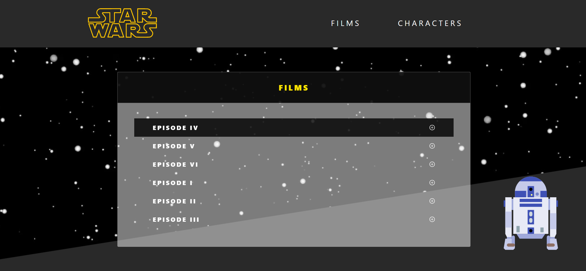

# Star Wars - Challenge

SPA con motivo a las películas de Star Wars.
Fuente de datos:
SWAPI, una API con toda la información esperada de los 6 Films de Star Wars y completamente abierta.
Enlace: https://swapi.dev

#### Presenta los siguientes componentes
- [ ] Films, donde se obtiene la información del Nombre del Film, número de episodio, director y un link de acceso al componente de Personajes.
- [ ] Characters, con una tabla de datos donde se obtienen las siguientes características para cada personaje: nombre, color de ojos y género.

La tabla así mismo presenta una serie de filtros globales y específicos para cada una de las columnas.

#### Tecnologías aplicadas en el Front End

- [ ] React
- [ ] React-Table
- [ ] Redux

|Films Component |
|--------------|
|